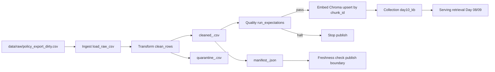

# Kiến trúc pipeline — Lab Day 10

**Nhóm:** Z11
**Cập nhật:** 2026-04-15

---

## 1. Sơ đồ luồng (bắt buộc có 1 diagram: Mermaid / ASCII)

Điểm đo chính:
- `run_id` được ghi ngay từ đầu run, xuất hiện trong log, tên file artifact và metadata embed.
- Freshness đo tại boundary `publish` qua manifest (`latest_exported_at` so với SLA giờ).
- Record lỗi được tách riêng vào `artifacts/quarantine/quarantine_<run_id>.csv`.

---

## 2. Ranh giới trách nhiệm

| Thành phần | Input | Output | Owner nhóm |
|------------|-------|--------|--------------|
| Ingest | `data/raw/policy_export_dirty.csv` (hoặc raw tùy chọn) | Danh sách row + log `raw_records` | Ingestion Owner |
| Transform | Raw rows | `cleaned_<run_id>.csv`, `quarantine_<run_id>.csv` | Cleaning / Quality Owner |
| Quality | Cleaned rows | Kết quả expectation `warn/halt`, quyết định publish | Cleaning / Quality Owner |
| Embed | Cleaned CSV đã pass gate (hoặc inject có chủ đích) | Upsert vào Chroma collection `day10_kb`, prune id cũ | Embed Owner |
| Monitor | `manifest_<run_id>.json`, env SLA | Trạng thái PASS/WARN/FAIL freshness + cảnh báo | Monitoring / Docs Owner |

---

## 3. Idempotency & rerun

Chiến lược idempotent:
- Upsert vector theo khóa ổn định `chunk_id`.
- Trước khi upsert, pipeline đọc toàn bộ id hiện có trong collection và xóa id không còn trong cleaned snapshot (`embed_prune_removed`).
- Mỗi metadata embed có `run_id` để trace provenance.

Kết luận rerun:
- Rerun 2 lần với cùng cleaned input không sinh duplicate vector vì `upsert` ghi đè theo `chunk_id`.
- Nếu dữ liệu run mới loại bỏ một số chunk cũ, bước prune đảm bảo index không giữ stale chunk.
- Đây là điều kiện quan trọng để before/after eval phản ánh đúng chất lượng dữ liệu hiện tại.

---

## 4. Liên hệ Day 09

Pipeline Day 10 là tầng dữ liệu trước retrieval:
- Cùng domain tài liệu CS + IT Helpdesk (`data/docs/`) với Day 08/09.
- Day 10 bổ sung bước kiểm soát chất lượng (clean, quarantine, expectation, freshness) trước khi dữ liệu đi vào vector store.
- Corpus publish (`day10_kb`) có thể dùng trực tiếp cho tác vụ retrieval/eval ở Day 09 để chứng minh tác động before/after khi dữ liệu bị stale hoặc đã được sửa.
- Khi inject corruption (`--no-refund-fix --skip-validate`), retrieval có thể trả context sai (ví dụ refund 14 ngày); khi chạy lại pipeline chuẩn, kết quả phải quay lại đúng canonical.

---

## 5. Rủi ro đã biết

- **Stale policy content trong index**: nguyên nhân thường do skip validate hoặc không prune id cũ.
	Mitigation: giữ gate `halt` cho rule refund stale, bắt buộc rerun chuẩn trước grading.
- **Freshness FAIL trên snapshot cũ**: `latest_exported_at` vượt SLA 24h dù pipeline vừa chạy.
	Mitigation: ghi rõ boundary trong runbook và cấu hình SLA nhất quán với ngữ cảnh bài.
- **Schema drift / parse ngày lỗi**: `effective_date` không ISO hoặc thiếu field bắt buộc.
	Mitigation: chuyển quarantine, không publish record lỗi.
- **Doc_id ngoài allowlist**: ingest nguồn ngoài hợp đồng làm nhiễu retrieval.
	Mitigation: enforce `allowed_doc_ids` trong cleaning và cập nhật contract khi thêm nguồn mới.
- **Chất lượng eval không phản ánh thực tế**: chỉ nhìn top-1 hoặc thiếu forbidden check.
	Mitigation: dùng đầy đủ cột eval (`contains_expected`, `hits_forbidden`, `top1_doc_matches`) và lưu before/after theo run_id.
